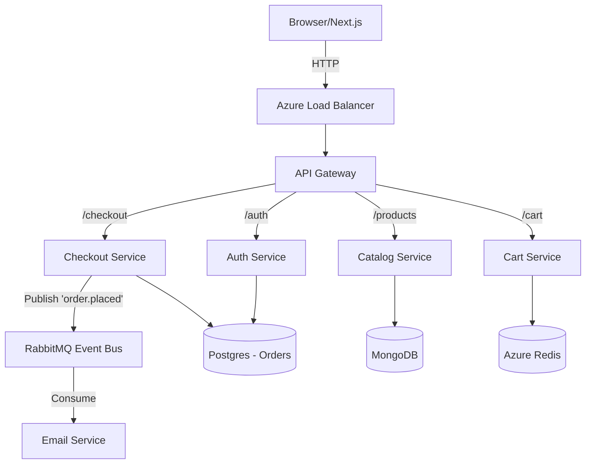

# System Architecture 🏛️

The Micro Shop platform utilizes a highly decoupled, event-driven architecture designed to handle e-commerce traffic at scale.

## 1. High-Level Communication Flow

We use a hybrid communication approach:
- **Synchronous (HTTP/REST)**: Used for client-to-service and service-to-service data fetching (e.g., retrieving products, verifying auth tokens).
- **Asynchronous (AMQP)**: Used for eventual consistency and background processing (e.g., sending emails after checkout, updating inventory).

## 2. Database Strategy (Polyglot Persistence)

Each microservice owns its own data. There are no shared databases, preventing tight coupling and single points of failure.

| Service | Datastore | Rationale |
| :--- | :--- | :--- |
| **Auth** | PostgreSQL | Relational integrity needed for user profiles and credentials. |
| **Catalog** | MongoDB Atlas | Document structure allows flexible, unstructured product attributes. |
| **Cart** | Azure Cache for Redis | High read/write throughput required; data is ephemeral. |
| **Checkout** | PostgreSQL | ACID transactions required for financial integrity. |

## 3. Event-Driven Workflows

When a user completes a purchase, the **Checkout Service** validates payment with Stripe and saves the order to PostgreSQL. Instead of waiting for the email to send before responding to the user, the service fires an asynchronous event.

1. **Exchange**: `shopping_exchange` (Topic Exchange)
2. **Routing Key**: `order.placed`
3. **Queue**: `email_queue`

The **Email Service** listens on this queue, parses the message, and uses Nodemailer to dispatch a confirmation email. If SMTP fails, the message is Negative-Acknowledged (`nack`) and requeued.

## 4. Security & Authentication

- **API Gateway**: Nginx terminates SSL/TLS (via LoadBalancer) and handles global CORS policies.
- **JWT**: The Auth service issues JSON Web Tokens. Downstream services (Cart, Checkout) decode these tokens from the `Authorization` header to identify users (`x-user-id`).
- **Google OAuth**: Integrated natively on the Next.js frontend. The frontend exchanges the Google token with our Auth service for a local JWT.

## 5. Kubernetes & Helm

Our infrastructure relies on Kubernetes for self-healing and scaling.
- **Helm**: We use a dynamic chart (`helm/micro-store`) to enforce zero-downtime rollouts.
- **Probes**: Every service has `readinessProbe` and `livenessProbe` endpoints (`/health`). If a pod deadlocks, Kubernetes will automatically restart it. Traffic is only routed to pods that pass readiness checks.
